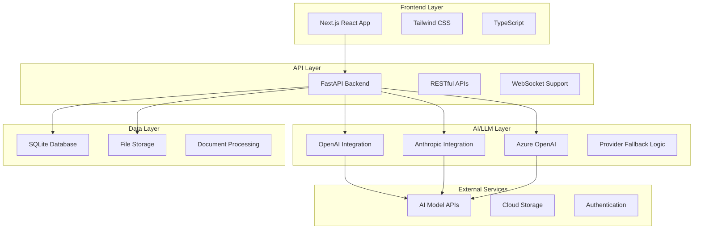

# Architecture

Understand the technical architecture and design principles behind ProtoScribe's clinical trial protocol optimization platform.

## System Overview

ProtoScribe is built as a modern, scalable web application with a microservices-inspired architecture that separates concerns and enables flexible deployment options.



## Core Components

### 1. Frontend Architecture

**Technology Stack:**
- **Framework**: Next.js 14 with App Router
- **Language**: TypeScript for type safety
- **Styling**: Tailwind CSS for utility-first design
- **State Management**: React hooks and context
- **API Client**: Custom fetch wrapper with error handling

**Key Features:**
- Server-side rendering (SSR) for optimal performance
- Progressive web app (PWA) capabilities
- Responsive design for all device types
- Real-time updates via WebSocket connections

### 2. Backend Architecture

**Technology Stack:**
- **Framework**: FastAPI for high-performance APIs
- **Language**: Python 3.11+ with type hints
- **Database**: SQLite with SQLAlchemy ORM
- **Validation**: Pydantic models for data validation
- **Documentation**: Auto-generated OpenAPI/Swagger docs

**Design Patterns:**
- **Repository Pattern**: Data access abstraction
- **Service Layer**: Business logic separation
- **Dependency Injection**: Loose coupling and testability
- **Factory Pattern**: AI provider instantiation

### 3. AI/LLM Integration

**Multi-Provider Architecture:**
```python
class LLMProvider(ABC):
    @abstractmethod
    async def analyze_protocol(self, content: str, guidelines: str) -> AnalysisResult:
        pass

class OpenAIProvider(LLMProvider):
    # OpenAI-specific implementation
    
class AnthropicProvider(LLMProvider):
    # Anthropic-specific implementation

class LLMManager:
    def __init__(self, providers: List[LLMProvider]):
        self.providers = providers
        self.fallback_chain = self._build_fallback_chain()
```

**Key Features:**
- **Provider Abstraction**: Unified interface for all AI models
- **Intelligent Fallback**: Automatic provider switching on failure
- **Rate Limiting**: Built-in request throttling and queuing
- **Response Caching**: Optimize costs and performance

### 4. Data Architecture

**Database Schema:**
```sql
-- Core entities
protocols
├── id (Primary Key)
├── title
├── content
├── file_path
├── status
├── created_at
└── updated_at

analyses
├── id (Primary Key)
├── protocol_id (Foreign Key)
├── provider
├── analysis_type
├── results (JSON)
├── score
└── created_at

suggestions
├── id (Primary Key)
├── analysis_id (Foreign Key)
├── section
├── type
├── content
├── confidence
└── status
```

**File Storage Structure:**
```
storage/
├── protocols/
│   ├── raw/          # Original uploaded files
│   ├── processed/    # Extracted text content
│   └── exports/      # Generated output files
├── templates/
│   ├── consort/      # CONSORT guideline templates
│   └── spirit/       # SPIRIT guideline templates
└── cache/
    ├── analyses/     # Cached analysis results
    └── embeddings/   # Vector embeddings for similarity
```

## Security Architecture

### Authentication & Authorization

**Current Implementation:**
- File-based session management
- API key validation for AI services
- Environment-based configuration

**Production Considerations:**
```python
# Future security enhancements
class SecurityConfig:
    ENABLE_JWT_AUTH = True
    OAUTH_PROVIDERS = ["google", "microsoft", "okta"]
    RBAC_ENABLED = True
    API_RATE_LIMITS = {
        "analyze": "10/minute",
        "upload": "5/minute",
        "export": "20/hour"
    }
```

### Data Protection

**Encryption:**
- In-transit: HTTPS/TLS for all communications
- At-rest: Database encryption for sensitive data
- API keys: Secure environment variable storage

**Privacy Controls:**
- Data anonymization options
- Configurable retention policies
- GDPR compliance features
- Audit trail logging

## Scalability Design

### Horizontal Scaling

**Backend Scaling:**
```yaml
# Docker Compose scaling
services:
  api:
    image: protoscribe-api
    replicas: 3
    environment:
      - DATABASE_URL=postgresql://...
      - REDIS_URL=redis://...
  
  worker:
    image: protoscribe-worker
    replicas: 5
    command: celery worker
```

**Database Scaling:**
- Read replicas for query performance
- Database sharding for large datasets
- Connection pooling and optimization

### Performance Optimization

**Caching Strategy:**
```python
# Multi-level caching
@redis_cache(ttl=3600)
async def get_analysis_results(protocol_id: str) -> AnalysisResult:
    # Check local cache first
    if result := local_cache.get(f"analysis:{protocol_id}"):
        return result
    
    # Query database and cache result
    result = await db.get_analysis(protocol_id)
    local_cache.set(f"analysis:{protocol_id}", result, ttl=300)
    return result
```

**Async Processing:**
- Background task queues for long-running operations
- WebSocket notifications for real-time updates
- Batch processing for multiple protocols

## Monitoring & Observability

### Application Monitoring

**Metrics Collection:**
```python
from prometheus_client import Counter, Histogram, Gauge

# Custom metrics
REQUEST_COUNT = Counter('http_requests_total', 'Total HTTP requests')
REQUEST_LATENCY = Histogram('http_request_duration_seconds', 'HTTP request latency')
ACTIVE_PROTOCOLS = Gauge('active_protocols_total', 'Number of active protocols')
AI_PROVIDER_HEALTH = Gauge('ai_provider_health', 'AI provider availability', ['provider'])
```

**Health Checks:**
- Database connectivity
- AI service availability
- File system access
- External dependency status

### Logging Strategy

**Structured Logging:**
```python
import structlog

logger = structlog.get_logger()

# Request logging
logger.info(
    "protocol_analysis_started",
    protocol_id=protocol.id,
    provider="openai",
    user_id=user.id,
    analysis_type="comprehensive"
)
```

**Log Levels:**
- **DEBUG**: Development and troubleshooting
- **INFO**: Normal operation events
- **WARNING**: Recoverable issues
- **ERROR**: Unhandled exceptions
- **CRITICAL**: System failures

## API Design

### RESTful Principles

**Resource-Based URLs:**
```
GET    /api/protocols/              # List all protocols
POST   /api/protocols/              # Create new protocol
GET    /api/protocols/{id}          # Get specific protocol
PUT    /api/protocols/{id}          # Update protocol
DELETE /api/protocols/{id}          # Delete protocol

POST   /api/protocols/{id}/analyze  # Analyze protocol
GET    /api/protocols/{id}/results  # Get analysis results
```

**HTTP Status Codes:**
- `200 OK`: Successful request
- `201 Created`: Resource created
- `400 Bad Request`: Client error
- `401 Unauthorized`: Authentication required
- `404 Not Found`: Resource not found
- `429 Too Many Requests`: Rate limited
- `500 Internal Server Error`: Server error

### API Versioning

**URL Versioning:**
```
/api/v1/protocols/     # Current stable version
/api/v2/protocols/     # Next version (beta)
```

**Version Compatibility:**
```python
class APIVersion(Enum):
    V1 = "v1"
    V2 = "v2"

@app.get("/api/{version}/protocols/")
async def list_protocols(version: APIVersion, ...):
    if version == APIVersion.V1:
        return legacy_response_format(protocols)
    return modern_response_format(protocols)
```

## Deployment Architecture

### Local Development

**Docker Compose Setup:**
```yaml
version: '3.8'
services:
  api:
    build: .
    ports:
      - "8000:8000"
    environment:
      - DATABASE_URL=sqlite:///./protoscribe.db
      - OPENAI_API_KEY=${OPENAI_API_KEY}
    volumes:
      - ./src:/app/src
      - ./storage:/app/storage

  frontend:
    build: ./frontend
    ports:
      - "3000:3000"
    environment:
      - NEXT_PUBLIC_API_URL=http://localhost:8000
```

### Production Deployment

**Cloud Architecture Options:**

#### Option 1: Container Orchestration
```yaml
# Kubernetes deployment
apiVersion: apps/v1
kind: Deployment
metadata:
  name: protoscribe-api
spec:
  replicas: 3
  selector:
    matchLabels:
      app: protoscribe-api
  template:
    metadata:
      labels:
        app: protoscribe-api
    spec:
      containers:
      - name: api
        image: protoscribe:latest
        ports:
        - containerPort: 8000
        env:
        - name: DATABASE_URL
          valueFrom:
            secretKeyRef:
              name: db-secret
              key: url
```

#### Option 2: Serverless Architecture
```python
# AWS Lambda handler
from mangum import Mangum
from src.protoscribe.main import app

handler = Mangum(app, lifespan="off")

# Vercel deployment for frontend
# vercel.json
{
  "builds": [
    {
      "src": "package.json",
      "use": "@vercel/next"
    }
  ]
}
```

## Technology Decisions

### Framework Selection

**Backend: FastAPI vs. Alternatives**
- ✅ **FastAPI**: Chosen for performance, type safety, and auto-documentation
- ❌ **Django**: Too heavyweight for API-focused application
- ❌ **Flask**: Lacks built-in validation and documentation features

**Frontend: Next.js vs. Alternatives**
- ✅ **Next.js**: Excellent developer experience, SSR, and ecosystem
- ❌ **React SPA**: Lacks SEO and initial load performance
- ❌ **Vue.js**: Smaller ecosystem for our use case

**Database: SQLite vs. Alternatives**
- ✅ **SQLite**: Simple deployment, sufficient for initial scale
- ⚠️ **PostgreSQL**: Better for production scale (future migration)
- ❌ **MongoDB**: Unnecessary complexity for structured data

### AI Provider Strategy

**Multi-Provider Approach:**
```python
class ProviderConfig:
    PRIMARY = "openai"      # Best general performance
    FALLBACK = "anthropic"  # Excellent safety and reasoning
    AZURE = "azure_openai"  # Enterprise compliance
    
    COST_OPTIMIZATION = True
    RESPONSE_TIME_PRIORITY = True
    QUALITY_THRESHOLD = 0.85
```

## Future Architecture Considerations

### Microservices Evolution

**Service Decomposition:**
```
protoscribe-api/           # Main API gateway
├── protocol-service/      # Protocol management
├── analysis-service/      # AI analysis engine
├── user-service/          # Authentication & authorization
├── notification-service/  # Real-time notifications
└── export-service/        # Document generation
```

### Event-Driven Architecture

**Event Bus Implementation:**
```python
# Event-driven updates
class ProtocolAnalyzed(Event):
    protocol_id: str
    analysis_id: str
    score: float
    timestamp: datetime

@event_handler(ProtocolAnalyzed)
async def update_dashboard(event: ProtocolAnalyzed):
    await websocket_manager.broadcast(
        f"protocol:{event.protocol_id}",
        {"type": "analysis_complete", "score": event.score}
    )
```

### Performance Targets

**Production SLAs:**
- API Response Time: 95th percentile < 200ms
- Protocol Upload: < 30 seconds for 10MB files
- AI Analysis: < 60 seconds for typical protocols
- System Availability: 99.9% uptime
- Data Durability: 99.999% (five nines)

!!! info "Architecture Evolution"
    This architecture is designed to evolve. We start with a monolithic deployment for simplicity and can migrate to microservices as scale demands increase.

!!! tip "Performance Monitoring"
    Set up comprehensive monitoring from day one. It's much easier to optimize what you can measure.

!!! warning "Security Considerations"
    Always validate and sanitize user input, especially when processing uploaded documents and sending content to external AI services.
