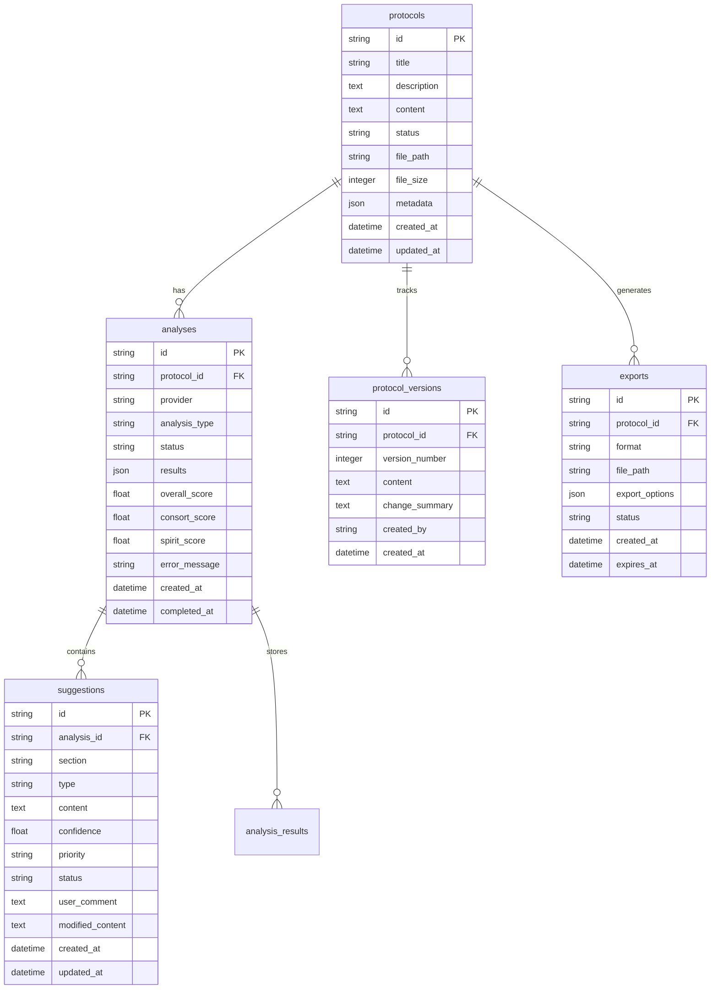

# Database

Comprehensive guide to ProtoScribe's database design, models, and data management strategies.

## Overview

ProtoScribe uses SQLite as its primary database with SQLAlchemy ORM for development and testing, with migration paths to PostgreSQL for production scaling. The database design emphasizes data integrity, performance, and clinical research workflow requirements.

## Database Architecture

### Technology Stack

- **Database Engine**: SQLite (development), PostgreSQL (production)
- **ORM**: SQLAlchemy with async support
- **Migrations**: Alembic for schema versioning
- **Connection Pooling**: SQLAlchemy connection pools
- **Caching**: Redis for query caching and session storage

### Schema Overview



## Data Models

### Core Models

#### Protocol Model
```python
# src/protoscribe/models/database.py

from sqlalchemy import Column, String, Text, Integer, DateTime, JSON, Float
from sqlalchemy.ext.declarative import declarative_base
from sqlalchemy.sql import func
import uuid

Base = declarative_base()

class Protocol(Base):
    __tablename__ = "protocols"
    
    id = Column(String, primary_key=True, default=lambda: f"proto_{uuid.uuid4().hex[:8]}")
    title = Column(String(255), nullable=False, index=True)
    description = Column(Text)
    content = Column(Text, nullable=False)
    status = Column(String(50), default="processing", index=True)  # processing, ready, error
    file_path = Column(String(500))
    file_size = Column(Integer)
    metadata = Column(JSON)
    created_at = Column(DateTime(timezone=True), server_default=func.now(), index=True)
    updated_at = Column(DateTime(timezone=True), onupdate=func.now())
    
    # Relationships
    analyses = relationship("Analysis", back_populates="protocol", cascade="all, delete-orphan")
    versions = relationship("ProtocolVersion", back_populates="protocol", cascade="all, delete-orphan")
    exports = relationship("Export", back_populates="protocol", cascade="all, delete-orphan")
    
    def __repr__(self):
        return f"<Protocol(id='{self.id}', title='{self.title}', status='{self.status}')>"
    
    @property
    def latest_analysis(self):
        """Get the most recent completed analysis"""
        return (
            object_session(self)
            .query(Analysis)
            .filter(Analysis.protocol_id == self.id, Analysis.status == "completed")
            .order_by(Analysis.completed_at.desc())
            .first()
        )
    
    def to_dict(self, include_content=False):
        """Convert to dictionary for API responses"""
        data = {
            "id": self.id,
            "title": self.title,
            "description": self.description,
            "status": self.status,
            "file_size": self.file_size,
            "metadata": self.metadata,
            "created_at": self.created_at.isoformat() if self.created_at else None,
            "updated_at": self.updated_at.isoformat() if self.updated_at else None,
        }
        
        if include_content:
            data["content"] = self.content
            
        return data
```

#### Analysis Model
```python
class Analysis(Base):
    __tablename__ = "analyses"
    
    id = Column(String, primary_key=True, default=lambda: f"analysis_{uuid.uuid4().hex[:8]}")
    protocol_id = Column(String, ForeignKey("protocols.id"), nullable=False, index=True)
    provider = Column(String(50), nullable=False, index=True)
    analysis_type = Column(String(50), default="comprehensive", index=True)
    status = Column(String(50), default="pending", index=True)  # pending, running, completed, failed
    results = Column(JSON)
    overall_score = Column(Float, index=True)
    consort_score = Column(Float, index=True)
    spirit_score = Column(Float, index=True)
    error_message = Column(Text)
    created_at = Column(DateTime(timezone=True), server_default=func.now(), index=True)
    completed_at = Column(DateTime(timezone=True), index=True)
    
    # Relationships
    protocol = relationship("Protocol", back_populates="analyses")
    suggestions = relationship("Suggestion", back_populates="analysis", cascade="all, delete-orphan")
    
    def __repr__(self):
        return f"<Analysis(id='{self.id}', protocol_id='{self.protocol_id}', status='{self.status}')>"
    
    @property
    def duration(self):
        """Calculate analysis duration in seconds"""
        if self.completed_at and self.created_at:
            return (self.completed_at - self.created_at).total_seconds()
        return None
    
    def to_dict(self):
        """Convert to dictionary for API responses"""
        return {
            "id": self.id,
            "protocol_id": self.protocol_id,
            "provider": self.provider,
            "analysis_type": self.analysis_type,
            "status": self.status,
            "results": self.results,
            "overall_score": self.overall_score,
            "consort_score": self.consort_score,
            "spirit_score": self.spirit_score,
            "error_message": self.error_message,
            "created_at": self.created_at.isoformat() if self.created_at else None,
            "completed_at": self.completed_at.isoformat() if self.completed_at else None,
            "duration": self.duration,
        }
```

#### Suggestion Model
```python
class Suggestion(Base):
    __tablename__ = "suggestions"
    
    id = Column(String, primary_key=True, default=lambda: f"sugg_{uuid.uuid4().hex[:8]}")
    analysis_id = Column(String, ForeignKey("analyses.id"), nullable=False, index=True)
    section = Column(String(100), nullable=False, index=True)
    type = Column(String(50), nullable=False, index=True)  # critical, improvement, style
    content = Column(Text, nullable=False)
    confidence = Column(Float, nullable=False, index=True)
    priority = Column(String(20), nullable=False, index=True)  # high, medium, low
    status = Column(String(50), default="pending", index=True)  # pending, accepted, rejected, modified
    user_comment = Column(Text)
    modified_content = Column(Text)
    guideline_reference = Column(String(100))
    rationale = Column(Text)
    created_at = Column(DateTime(timezone=True), server_default=func.now())
    updated_at = Column(DateTime(timezone=True), onupdate=func.now())
    
    # Relationships
    analysis = relationship("Analysis", back_populates="suggestions")
    
    def __repr__(self):
        return f"<Suggestion(id='{self.id}', type='{self.type}', priority='{self.priority}', status='{self.status}')>"
    
    def to_dict(self):
        """Convert to dictionary for API responses"""
        return {
            "id": self.id,
            "analysis_id": self.analysis_id,
            "section": self.section,
            "type": self.type,
            "content": self.content,
            "confidence": self.confidence,
            "priority": self.priority,
            "status": self.status,
            "user_comment": self.user_comment,
            "modified_content": self.modified_content,
            "guideline_reference": self.guideline_reference,
            "rationale": self.rationale,
            "created_at": self.created_at.isoformat() if self.created_at else None,
            "updated_at": self.updated_at.isoformat() if self.updated_at else None,
        }
```

### Supporting Models

#### Protocol Version Model
```python
class ProtocolVersion(Base):
    __tablename__ = "protocol_versions"
    
    id = Column(String, primary_key=True, default=lambda: f"version_{uuid.uuid4().hex[:8]}")
    protocol_id = Column(String, ForeignKey("protocols.id"), nullable=False, index=True)
    version_number = Column(Integer, nullable=False)
    content = Column(Text, nullable=False)
    change_summary = Column(Text)
    created_by = Column(String(100))  # User identifier
    created_at = Column(DateTime(timezone=True), server_default=func.now(), index=True)
    
    # Relationships
    protocol = relationship("Protocol", back_populates="versions")
    
    __table_args__ = (
        UniqueConstraint('protocol_id', 'version_number', name='unique_protocol_version'),
        Index('idx_protocol_version', 'protocol_id', 'version_number'),
    )
    
    def to_dict(self):
        return {
            "id": self.id,
            "protocol_id": self.protocol_id,
            "version_number": self.version_number,
            "content": self.content,
            "change_summary": self.change_summary,
            "created_by": self.created_by,
            "created_at": self.created_at.isoformat() if self.created_at else None,
        }
```

#### Export Model
```python
class Export(Base):
    __tablename__ = "exports"
    
    id = Column(String, primary_key=True, default=lambda: f"export_{uuid.uuid4().hex[:8]}")
    protocol_id = Column(String, ForeignKey("protocols.id"), nullable=False, index=True)
    format = Column(String(20), nullable=False)  # pdf, docx, html, markdown
    file_path = Column(String(500))
    export_options = Column(JSON)
    status = Column(String(50), default="pending", index=True)  # pending, processing, completed, failed, expired
    error_message = Column(Text)
    file_size = Column(Integer)
    created_at = Column(DateTime(timezone=True), server_default=func.now(), index=True)
    completed_at = Column(DateTime(timezone=True))
    expires_at = Column(DateTime(timezone=True), index=True)
    
    # Relationships
    protocol = relationship("Protocol", back_populates="exports")
    
    def __repr__(self):
        return f"<Export(id='{self.id}', format='{self.format}', status='{self.status}')>"
    
    @property
    def is_expired(self):
        """Check if export has expired"""
        if self.expires_at:
            return datetime.utcnow() > self.expires_at
        return False
    
    def to_dict(self):
        return {
            "id": self.id,
            "protocol_id": self.protocol_id,
            "format": self.format,
            "export_options": self.export_options,
            "status": self.status,
            "error_message": self.error_message,
            "file_size": self.file_size,
            "created_at": self.created_at.isoformat() if self.created_at else None,
            "completed_at": self.completed_at.isoformat() if self.completed_at else None,
            "expires_at": self.expires_at.isoformat() if self.expires_at else None,
            "is_expired": self.is_expired,
        }
```

## Database Configuration

### Connection Setup

```python
# src/protoscribe/core/database.py

from sqlalchemy import create_engine
from sqlalchemy.ext.asyncio import AsyncSession, create_async_engine
from sqlalchemy.orm import sessionmaker
from sqlalchemy.pool import StaticPool
import os

DATABASE_URL = os.getenv("DATABASE_URL", "sqlite:///./protoscribe.db")

# For development (SQLite)
if DATABASE_URL.startswith("sqlite"):
    engine = create_engine(
        DATABASE_URL,
        connect_args={"check_same_thread": False},
        poolclass=StaticPool,
        echo=False  # Set to True for SQL debugging
    )
    
    # Async engine for async operations
    async_engine = create_async_engine(
        DATABASE_URL.replace("sqlite://", "sqlite+aiosqlite://"),
        connect_args={"check_same_thread": False},
        poolclass=StaticPool,
        echo=False
    )

# For production (PostgreSQL)
else:
    engine = create_engine(
        DATABASE_URL,
        pool_size=20,
        max_overflow=0,
        pool_pre_ping=True,
        pool_recycle=300,
        echo=False
    )
    
    async_engine = create_async_engine(
        DATABASE_URL,
        pool_size=20,
        max_overflow=0,
        pool_pre_ping=True,
        pool_recycle=300,
        echo=False
    )

# Session factories
SessionLocal = sessionmaker(autocommit=False, autoflush=False, bind=engine)
AsyncSessionLocal = sessionmaker(
    async_engine, 
    class_=AsyncSession, 
    expire_on_commit=False
)

# Database dependency for FastAPI
async def get_db():
    async with AsyncSessionLocal() as session:
        try:
            yield session
        finally:
            await session.close()

# Initialize database
def init_db():
    """Initialize database tables"""
    from .models.database import Base
    Base.metadata.create_all(bind=engine)

# Health check
async def check_db_health():
    """Check database connectivity"""
    try:
        async with AsyncSessionLocal() as session:
            await session.execute(text("SELECT 1"))
            return True
    except Exception as e:
        logger.error(f"Database health check failed: {e}")
        return False
```

### Migration Management

```python
# alembic/env.py

from alembic import context
from sqlalchemy import engine_from_config, pool
from logging.config import fileConfig
import os

# Import your models
from src.protoscribe.models.database import Base

# Alembic Config object
config = context.config

# Set up logging
if config.config_file_name is not None:
    fileConfig(config.config_file_name)

# Set target metadata
target_metadata = Base.metadata

def get_url():
    """Get database URL from environment or config"""
    url = os.getenv("DATABASE_URL")
    if url:
        return url
    return config.get_main_option("sqlalchemy.url")

def run_migrations_offline():
    """Run migrations in 'offline' mode"""
    url = get_url()
    context.configure(
        url=url,
        target_metadata=target_metadata,
        literal_binds=True,
        dialect_opts={"paramstyle": "named"},
    )

    with context.begin_transaction():
        context.run_migrations()

def run_migrations_online():
    """Run migrations in 'online' mode"""
    configuration = config.get_section(config.config_ini_section)
    configuration["sqlalchemy.url"] = get_url()
    
    connectable = engine_from_config(
        configuration,
        prefix="sqlalchemy.",
        poolclass=pool.NullPool,
    )

    with connectable.connect() as connection:
        context.configure(
            connection=connection, 
            target_metadata=target_metadata
        )

        with context.begin_transaction():
            context.run_migrations()

if context.is_offline_mode():
    run_migrations_offline()
else:
    run_migrations_online()
```

## Repository Pattern

### Base Repository

```python
# src/protoscribe/repositories/base.py

from abc import ABC, abstractmethod
from typing import Generic, TypeVar, List, Optional, Dict, Any
from sqlalchemy.ext.asyncio import AsyncSession
from sqlalchemy import select, update, delete, func
from sqlalchemy.orm import selectinload

T = TypeVar('T')

class BaseRepository(Generic[T], ABC):
    def __init__(self, session: AsyncSession, model_class: type):
        self.session = session
        self.model_class = model_class
    
    async def create(self, **kwargs) -> T:
        """Create a new record"""
        instance = self.model_class(**kwargs)
        self.session.add(instance)
        await self.session.commit()
        await self.session.refresh(instance)
        return instance
    
    async def get_by_id(self, id: str) -> Optional[T]:
        """Get record by ID"""
        result = await self.session.execute(
            select(self.model_class).where(self.model_class.id == id)
        )
        return result.scalar_one_or_none()
    
    async def get_all(
        self, 
        skip: int = 0, 
        limit: int = 100, 
        filters: Dict[str, Any] = None
    ) -> List[T]:
        """Get all records with pagination and filters"""
        query = select(self.model_class)
        
        # Apply filters
        if filters:
            for field, value in filters.items():
                if hasattr(self.model_class, field):
                    query = query.where(getattr(self.model_class, field) == value)
        
        # Apply pagination
        query = query.offset(skip).limit(limit)
        
        result = await self.session.execute(query)
        return result.scalars().all()
    
    async def count(self, filters: Dict[str, Any] = None) -> int:
        """Count records with optional filters"""
        query = select(func.count(self.model_class.id))
        
        if filters:
            for field, value in filters.items():
                if hasattr(self.model_class, field):
                    query = query.where(getattr(self.model_class, field) == value)
        
        result = await self.session.execute(query)
        return result.scalar()
    
    async def update(self, id: str, **kwargs) -> Optional[T]:
        """Update record by ID"""
        await self.session.execute(
            update(self.model_class)
            .where(self.model_class.id == id)
            .values(**kwargs)
        )
        await self.session.commit()
        return await self.get_by_id(id)
    
    async def delete(self, id: str) -> bool:
        """Delete record by ID"""
        result = await self.session.execute(
            delete(self.model_class).where(self.model_class.id == id)
        )
        await self.session.commit()
        return result.rowcount > 0
```

### Protocol Repository

```python
# src/protoscribe/repositories/protocol.py

from typing import List, Optional, Dict, Any
from sqlalchemy import select, func, desc
from sqlalchemy.orm import selectinload
from .base import BaseRepository
from ..models.database import Protocol, Analysis

class ProtocolRepository(BaseRepository[Protocol]):
    def __init__(self, session):
        super().__init__(session, Protocol)
    
    async def get_with_latest_analysis(self, protocol_id: str) -> Optional[Protocol]:
        """Get protocol with its latest analysis"""
        query = (
            select(Protocol)
            .options(selectinload(Protocol.analyses))
            .where(Protocol.id == protocol_id)
        )
        
        result = await self.session.execute(query)
        protocol = result.scalar_one_or_none()
        
        if protocol and protocol.analyses:
            # Sort analyses by completion date
            protocol.analyses.sort(
                key=lambda a: a.completed_at or a.created_at, 
                reverse=True
            )
        
        return protocol
    
    async def get_by_status(self, status: str, limit: int = 100) -> List[Protocol]:
        """Get protocols by status"""
        query = (
            select(Protocol)
            .where(Protocol.status == status)
            .order_by(desc(Protocol.created_at))
            .limit(limit)
        )
        
        result = await self.session.execute(query)
        return result.scalars().all()
    
    async def search(
        self, 
        query_text: str, 
        skip: int = 0, 
        limit: int = 20
    ) -> List[Protocol]:
        """Search protocols by title and description"""
        search_query = (
            select(Protocol)
            .where(
                Protocol.title.ilike(f"%{query_text}%") |
                Protocol.description.ilike(f"%{query_text}%")
            )
            .order_by(desc(Protocol.created_at))
            .offset(skip)
            .limit(limit)
        )
        
        result = await self.session.execute(search_query)
        return result.scalars().all()
    
    async def get_analytics(self, days: int = 30) -> Dict[str, Any]:
        """Get protocol analytics for dashboard"""
        from datetime import datetime, timedelta
        
        cutoff_date = datetime.utcnow() - timedelta(days=days)
        
        # Total protocols
        total_result = await self.session.execute(
            select(func.count(Protocol.id))
        )
        total_protocols = total_result.scalar()
        
        # Recent protocols
        recent_result = await self.session.execute(
            select(func.count(Protocol.id))
            .where(Protocol.created_at >= cutoff_date)
        )
        recent_protocols = recent_result.scalar()
        
        # By status
        status_result = await self.session.execute(
            select(Protocol.status, func.count(Protocol.id))
            .group_by(Protocol.status)
        )
        by_status = dict(status_result.all())
        
        # Average file size
        avg_size_result = await self.session.execute(
            select(func.avg(Protocol.file_size))
            .where(Protocol.file_size.isnot(None))
        )
        avg_file_size = avg_size_result.scalar() or 0
        
        return {
            "total_protocols": total_protocols,
            "recent_protocols": recent_protocols,
            "by_status": by_status,
            "avg_file_size": int(avg_file_size),
            "period_days": days
        }
```

### Analysis Repository

```python
# src/protoscribe/repositories/analysis.py

from typing import List, Optional, Dict, Any
from sqlalchemy import select, func, desc, and_
from sqlalchemy.orm import selectinload
from .base import BaseRepository
from ..models.database import Analysis, Suggestion

class AnalysisRepository(BaseRepository[Analysis]):
    def __init__(self, session):
        super().__init__(session, Analysis)
    
    async def get_with_suggestions(self, analysis_id: str) -> Optional[Analysis]:
        """Get analysis with all suggestions"""
        query = (
            select(Analysis)
            .options(selectinload(Analysis.suggestions))
            .where(Analysis.id == analysis_id)
        )
        
        result = await self.session.execute(query)
        return result.scalar_one_or_none()
    
    async def get_latest_for_protocol(self, protocol_id: str) -> Optional[Analysis]:
        """Get latest completed analysis for protocol"""
        query = (
            select(Analysis)
            .where(
                and_(
                    Analysis.protocol_id == protocol_id,
                    Analysis.status == "completed"
                )
            )
            .order_by(desc(Analysis.completed_at))
        )
        
        result = await self.session.execute(query)
        return result.scalar_one_or_none()
    
    async def get_by_provider(
        self, 
        provider: str, 
        limit: int = 100
    ) -> List[Analysis]:
        """Get analyses by provider"""
        query = (
            select(Analysis)
            .where(Analysis.provider == provider)
            .order_by(desc(Analysis.created_at))
            .limit(limit)
        )
        
        result = await self.session.execute(query)
        return result.scalars().all()
    
    async def get_performance_metrics(self) -> Dict[str, Any]:
        """Get analysis performance metrics"""
        
        # Average scores by provider
        score_query = await self.session.execute(
            select(
                Analysis.provider,
                func.avg(Analysis.overall_score).label('avg_overall'),
                func.avg(Analysis.consort_score).label('avg_consort'),
                func.avg(Analysis.spirit_score).label('avg_spirit'),
                func.count(Analysis.id).label('count')
            )
            .where(Analysis.status == 'completed')
            .group_by(Analysis.provider)
        )
        
        provider_metrics = {}
        for row in score_query.all():
            provider_metrics[row.provider] = {
                "avg_overall_score": round(row.avg_overall, 2) if row.avg_overall else 0,
                "avg_consort_score": round(row.avg_consort, 2) if row.avg_consort else 0,
                "avg_spirit_score": round(row.avg_spirit, 2) if row.avg_spirit else 0,
                "total_analyses": row.count
            }
        
        # Success rate by provider
        success_query = await self.session.execute(
            select(
                Analysis.provider,
                func.count(Analysis.id).label('total'),
                func.sum(
                    func.case([(Analysis.status == 'completed', 1)], else_=0)
                ).label('successful')
            )
            .group_by(Analysis.provider)
        )
        
        for row in success_query.all():
            if row.provider in provider_metrics:
                success_rate = (row.successful / row.total * 100) if row.total > 0 else 0
                provider_metrics[row.provider]["success_rate"] = round(success_rate, 2)
        
        return provider_metrics
```

## Performance Optimization

### Indexing Strategy

```sql
-- Database indexes for optimal query performance

-- Protocol indexes
CREATE INDEX idx_protocols_status ON protocols(status);
CREATE INDEX idx_protocols_created_at ON protocols(created_at);
CREATE INDEX idx_protocols_title ON protocols(title);
CREATE INDEX idx_protocols_status_created ON protocols(status, created_at);

-- Analysis indexes
CREATE INDEX idx_analyses_protocol_id ON analyses(protocol_id);
CREATE INDEX idx_analyses_status ON analyses(status);
CREATE INDEX idx_analyses_provider ON analyses(provider);
CREATE INDEX idx_analyses_created_at ON analyses(created_at);
CREATE INDEX idx_analyses_completed_at ON analyses(completed_at);
CREATE INDEX idx_analyses_overall_score ON analyses(overall_score);
CREATE INDEX idx_analyses_protocol_status ON analyses(protocol_id, status);
CREATE INDEX idx_analyses_provider_status ON analyses(provider, status);

-- Suggestion indexes
CREATE INDEX idx_suggestions_analysis_id ON suggestions(analysis_id);
CREATE INDEX idx_suggestions_type ON suggestions(type);
CREATE INDEX idx_suggestions_priority ON suggestions(priority);
CREATE INDEX idx_suggestions_status ON suggestions(status);
CREATE INDEX idx_suggestions_confidence ON suggestions(confidence);
CREATE INDEX idx_suggestions_analysis_type ON suggestions(analysis_id, type);

-- Composite indexes for common queries
CREATE INDEX idx_protocols_search ON protocols(status, created_at DESC);
CREATE INDEX idx_analyses_dashboard ON analyses(status, created_at DESC);
CREATE INDEX idx_suggestions_review ON suggestions(status, priority, created_at);
```

### Query Optimization

```python
# Optimized query examples

class OptimizedQueries:
    def __init__(self, session: AsyncSession):
        self.session = session
    
    async def get_dashboard_data(self) -> Dict[str, Any]:
        """Optimized dashboard query with minimal database hits"""
        
        # Single query for protocol counts by status
        protocol_stats = await self.session.execute(
            select(
                Protocol.status,
                func.count(Protocol.id).label('count'),
                func.avg(Protocol.file_size).label('avg_size')
            )
            .group_by(Protocol.status)
        )
        
        # Single query for recent analysis activity
        recent_analyses = await self.session.execute(
            select(
                Analysis.provider,
                func.count(Analysis.id).label('count'),
                func.avg(Analysis.overall_score).label('avg_score')
            )
            .where(Analysis.created_at >= func.date('now', '-7 days'))
            .group_by(Analysis.provider)
        )
        
        # Combine results
        return {
            "protocol_stats": {row.status: {"count": row.count, "avg_size": row.avg_size} 
                             for row in protocol_stats.all()},
            "recent_analyses": {row.provider: {"count": row.count, "avg_score": row.avg_score}
                              for row in recent_analyses.all()}
        }
    
    async def get_protocol_with_analysis_summary(self, protocol_id: str) -> Optional[Dict]:
        """Get protocol with analysis summary in single query"""
        
        query = await self.session.execute(
            select(
                Protocol.id,
                Protocol.title,
                Protocol.description,
                Protocol.status,
                Protocol.created_at,
                func.count(Analysis.id).label('analysis_count'),
                func.max(Analysis.overall_score).label('best_score'),
                func.max(Analysis.completed_at).label('latest_analysis')
            )
            .outerjoin(Analysis, Protocol.id == Analysis.protocol_id)
            .where(Protocol.id == protocol_id)
            .group_by(Protocol.id)
        )
        
        row = query.first()
        if row:
            return {
                "id": row.id,
                "title": row.title,
                "description": row.description,
                "status": row.status,
                "created_at": row.created_at,
                "analysis_count": row.analysis_count,
                "best_score": row.best_score,
                "latest_analysis": row.latest_analysis
            }
        return None
```

### Connection Pooling

```python
# Production database configuration with connection pooling

from sqlalchemy.pool import QueuePool
from sqlalchemy import event

def configure_production_db():
    """Configure database for production with optimal pooling"""
    
    DATABASE_URL = os.getenv("DATABASE_URL")
    
    engine = create_engine(
        DATABASE_URL,
        poolclass=QueuePool,
        pool_size=20,              # Number of connections to maintain
        max_overflow=10,           # Additional connections beyond pool_size
        pool_pre_ping=True,        # Validate connections before use
        pool_recycle=3600,         # Recycle connections every hour
        echo_pool=True,            # Log pool activity (disable in production)
        connect_args={
            "application_name": "protoscribe",
            "options": "-c timezone=UTC"
        }
    )
    
    # Event listeners for monitoring
    @event.listens_for(engine, "connect")
    def set_sqlite_pragma(dbapi_connection, connection_record):
        if 'sqlite' in DATABASE_URL:
            cursor = dbapi_connection.cursor()
            cursor.execute("PRAGMA foreign_keys=ON")
            cursor.execute("PRAGMA journal_mode=WAL")
            cursor.execute("PRAGMA synchronous=NORMAL")
            cursor.execute("PRAGMA cache_size=1000")
            cursor.execute("PRAGMA temp_store=MEMORY")
            cursor.close()
    
    return engine
```

## Data Backup and Recovery

### Backup Strategy

```python
# src/protoscribe/core/backup.py

import os
import shutil
import gzip
from datetime import datetime
from pathlib import Path

class DatabaseBackup:
    def __init__(self, db_path: str, backup_dir: str):
        self.db_path = Path(db_path)
        self.backup_dir = Path(backup_dir)
        self.backup_dir.mkdir(exist_ok=True)
    
    def create_backup(self) -> str:
        """Create compressed database backup"""
        timestamp = datetime.now().strftime("%Y%m%d_%H%M%S")
        backup_filename = f"protoscribe_backup_{timestamp}.db.gz"
        backup_path = self.backup_dir / backup_filename
        
        # Create compressed backup
        with open(self.db_path, 'rb') as f_in:
            with gzip.open(backup_path, 'wb') as f_out:
                shutil.copyfileobj(f_in, f_out)
        
        return str(backup_path)
    
    def restore_backup(self, backup_path: str):
        """Restore database from backup"""
        backup_file = Path(backup_path)
        
        if not backup_file.exists():
            raise FileNotFoundError(f"Backup file not found: {backup_path}")
        
        # Create backup of current database
        current_backup = self.create_backup()
        print(f"Current database backed up to: {current_backup}")
        
        # Restore from backup
        with gzip.open(backup_file, 'rb') as f_in:
            with open(self.db_path, 'wb') as f_out:
                shutil.copyfileobj(f_in, f_out)
        
        print(f"Database restored from: {backup_path}")
    
    def cleanup_old_backups(self, keep_days: int = 30):
        """Remove backups older than specified days"""
        cutoff = datetime.now().timestamp() - (keep_days * 24 * 60 * 60)
        
        for backup_file in self.backup_dir.glob("protoscribe_backup_*.db.gz"):
            if backup_file.stat().st_mtime < cutoff:
                backup_file.unlink()
                print(f"Removed old backup: {backup_file}")

# Automated backup scheduling
import asyncio
from apscheduler.schedulers.asyncio import AsyncIOScheduler

async def setup_backup_scheduler():
    """Set up automated backup scheduling"""
    backup_manager = DatabaseBackup(
        db_path="./protoscribe.db",
        backup_dir="./backups"
    )
    
    scheduler = AsyncIOScheduler()
    
    # Daily backup at 2 AM
    scheduler.add_job(
        backup_manager.create_backup,
        'cron',
        hour=2,
        minute=0,
        id='daily_backup'
    )
    
    # Weekly cleanup
    scheduler.add_job(
        backup_manager.cleanup_old_backups,
        'cron',
        day_of_week='sun',
        hour=3,
        minute=0,
        id='weekly_cleanup'
    )
    
    scheduler.start()
    return scheduler
```

!!! tip "Database Best Practices"
    - Use connection pooling for production deployments
    - Implement proper indexing for frequently queried columns
    - Regularly backup your database and test restore procedures
    - Monitor query performance and optimize slow queries
    - Use database migrations for schema changes

!!! warning "Data Integrity"
    - Always use transactions for multi-step operations
    - Implement proper foreign key constraints
    - Validate data at both application and database levels
    - Be cautious with bulk operations and test them thoroughly

!!! info "Scaling Considerations"
    - Start with SQLite for development and small deployments
    - Migrate to PostgreSQL for production scale
    - Consider read replicas for high-traffic scenarios
    - Implement database monitoring and alerting
    - Plan for data archival and cleanup strategies
