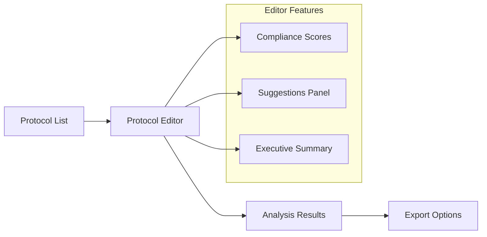

# Quick Start

Get up and running with ProtoScribe in under 5 minutes! This guide will walk you through analyzing your first clinical trial protocol.

## Step 1: Start the Application

### Backend

```bash
# Activate virtual environment
source .venv/bin/activate  # On Windows: .venv\Scripts\activate

# Start the backend server
python start_backend.py
```

!!! success "Backend Started"
    When successful, you'll see:
    ```
    Starting ProtoScribe Backend Server...
    Visit http://localhost:8000/docs for API documentation
    INFO: Uvicorn running on http://0.0.0.0:8000
    ```

### Frontend

```bash
# In a new terminal, navigate to frontend
cd frontend

# Start the development server
npm run dev
```

!!! success "Frontend Started"
    When successful, you'll see:
    ```
    ready - started server on 0.0.0.0:3000, url: http://localhost:3000
    ```

## Step 2: Access the Application

Open your web browser and navigate to:

- **Main Application**: http://localhost:3000
- **API Documentation**: http://localhost:8000/docs
- **Protocol Editor**: http://localhost:3000/editor

## Step 3: Create a Sample Protocol

Let's create a sample protocol to work with:

### Using the API

```bash
curl -X POST "http://localhost:8000/api/v1/protocols/create-sample" \
     -H "accept: application/json"
```

### Using the Web Interface

1. Navigate to http://localhost:3000/editor
2. The interface will automatically load a sample protocol
3. You'll see the "Hypertension Treatment Study" ready for analysis

## Step 4: Run Your First Analysis

### Method 1: Web Interface

1. **Open the Protocol Editor** at http://localhost:3000/editor
2. **Click "Run Analysis"** button in the top-right corner
3. **Watch the analysis progress** - you'll see a loading indicator
4. **Review the results** when complete

### Method 2: API Call

```bash
curl -X POST "http://localhost:8000/api/v1/analysis/protocol_123/comprehensive" \
     -H "accept: application/json"
```

## Step 5: Explore the Results

After running the analysis, you'll see:

=== "Compliance Scores"

    
    
    - **Overall Score**: 85.5/100
    - **CONSORT Compliance**: 88.0%
    - **SPIRIT Compliance**: 83.0%
    - **Clarity Score**: 82.5%
    - **Consistency Score**: 89.0%

=== "AI Suggestions"

    
    
    You'll see categorized suggestions:
    
    - **Missing Items** - Required sections not found
    - **Clarity Issues** - Text that could be clearer
    - **Consistency Problems** - Internal contradictions

=== "Interactive Actions"

    
    
    For each suggestion, you can:
    
    - ✅ **Accept** - Apply the suggestion as-is
    - ✏️ **Modify** - Edit the suggestion before applying
    - ❌ **Reject** - Dismiss the suggestion

## Step 6: Work with Suggestions

### Accept a Suggestion

1. **Find a suggestion** you want to accept
2. **Click the "Accept" button**
3. **See the status** change to "accepted" with a green indicator

### Modify a Suggestion

1. **Click "Modify"** on any suggestion
2. **Edit the text** in the modal that appears
3. **Click "Save Changes"** to apply your modifications

### Filter Suggestions

Use the dropdown menu to filter suggestions by type:

- **All Types** - Show everything
- **Missing Items** - Show only missing required sections
- **Clarity Issues** - Show only clarity improvements
- **Consistency Issues** - Show only consistency problems

## Step 7: Review the Executive Summary

The right panel contains an AI-generated executive summary of your protocol's strengths and areas for improvement.

!!! tip "Executive Summary Features"
    - **Strengths Analysis** - What your protocol does well
    - **Improvement Areas** - Key areas to focus on
    - **Compliance Overview** - Overall guideline adherence
    - **Action Items** - Prioritized next steps

## Understanding the Interface

### Main Navigation



### Status Indicators

| Status | Color | Meaning |
|--------|-------|---------|
| **Pending** | 🟡 Orange | Suggestion awaiting review |
| **Accepted** | 🟢 Green | Suggestion approved and applied |
| **Modified** | 🔵 Blue | Suggestion edited and applied |
| **Rejected** | 🔴 Red | Suggestion dismissed |

## API Quick Reference

### Key Endpoints

| Endpoint | Method | Description |
|----------|--------|-------------|
| `/api/v1/protocols/` | GET | List all protocols |
| `/api/v1/protocols/create-sample` | POST | Create test protocol |
| `/api/v1/analysis/{id}/comprehensive` | POST | Run full analysis |
| `/api/v1/analysis/{id}/formatted-analysis` | GET | Get UI-ready results |

### Example API Usage

```bash
# Get protocol list
curl http://localhost:8000/api/v1/protocols/

# Run comprehensive analysis
curl -X POST http://localhost:8000/api/v1/analysis/protocol_123/comprehensive

# Get formatted results
curl http://localhost:8000/api/v1/analysis/protocol_123/formatted-analysis
```

## Next Steps

Now that you've completed the quick start:

1. **Upload your own protocol** - See [Protocol Upload Guide](../user-guide/protocol-upload.md)
2. **Configure AI providers** - See [Configuration Guide](configuration.md)
3. **Explore advanced features** - See [User Guide](../user-guide/overview.md)
4. **Integrate with your workflow** - See [API Reference](../api-reference/overview.md)

## Troubleshooting

### Common Issues

!!! warning "Port Already in Use"
    If you see "Port 8000 already in use":
    ```bash
    # Find and kill the process
    lsof -ti:8000 | xargs kill -9
    ```

!!! warning "Module Not Found"
    If you see import errors:
    ```bash
    # Reinstall dependencies
    pip install -e .
    ```

!!! warning "Frontend Won't Start"
    If npm fails to start:
    ```bash
    # Clear cache and reinstall
    rm -rf node_modules package-lock.json
    npm install
    ```

### Getting Help

- 📖 **Documentation**: Continue reading this guide
- 🐛 **Issues**: [Report bugs](https://github.com/sonishsivarajkumar/ProtoScribe/issues)
- 💬 **Discussions**: [Ask questions](https://github.com/sonishsivarajkumar/ProtoScribe/discussions)

!!! success "Congratulations!"
    You've successfully set up ProtoScribe and run your first protocol analysis! 🎉
