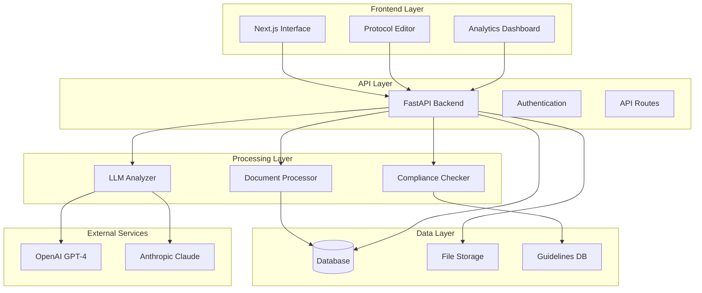

# ProtoScribe

<div align="center">
  
  
  **Clinical Trial Protocol AI Optimizer**
  
  *Automated compliance checking and AI-powered optimization for clinical trial protocols*
  
  [](LICENSE)
  [](https://python.org)
  [](https://fastapi.tiangolo.com)
  [](https://nextjs.org)
  [](https://sonishsivarajkumar.github.io/ProtoScribe)
</div>

---

## Overview

ProtoScribe is an advanced AI-powered platform designed to optimize clinical trial protocols by ensuring compliance with international guidelines (CONSORT/SPIRIT) and providing intelligent suggestions for improvement. The platform combines rule-based compliance checking with state-of-the-art language models to deliver comprehensive protocol analysis.

### 🎯 Key Features

=== "AI-Powered Analysis"

    - **Multi-Provider LLM Support** - OpenAI GPT-4 and Anthropic Claude integration
    - **Comprehensive Evaluation** - Missing items, clarity, consistency analysis
    - **Confidence Scoring** - AI-generated confidence levels for suggestions
    - **Guideline Integration** - CONSORT/SPIRIT compliance verification

=== "Interactive Interface"

    - **Real-time Analysis** - Live protocol scoring and metrics
    - **Suggestion Workflow** - Accept, modify, or reject AI recommendations
    - **Visual Dashboard** - Intuitive compliance scoring display
    - **Export Capabilities** - Generate improved protocol documents

=== "Enterprise Ready"

    - **Scalable Architecture** - FastAPI backend with Next.js frontend
    - **Secure Processing** - Local deployment options for sensitive data
    - **API-First Design** - RESTful APIs for integration
    - **Version Control** - Track protocol changes over time

## Quick Start

### Installation

```bash
# Clone the repository
git clone https://github.com/sonishsivarajkumar/ProtoScribe.git
cd ProtoScribe

# Set up Python environment
python -m venv .venv
source .venv/bin/activate  # On Windows: .venv\Scripts\activate
pip install -e .

# Set up frontend
cd frontend
npm install
```

### Configuration

```bash
# Copy environment template
cp .env.example .env

# Add your API keys (optional)
OPENAI_API_KEY=your-openai-key
ANTHROPIC_API_KEY=your-anthropic-key
```

### Running the Application

=== "Backend"

    ```bash
    # Start the API server
    python start_backend.py
    ```
    
    🌐 **Backend**: http://localhost:8000  
    📚 **API Docs**: http://localhost:8000/docs

=== "Frontend"

    ```bash
    # Start the web interface
    cd frontend
    npm run dev
    ```
    
    🖥️ **Frontend**: http://localhost:3000

## Architecture



## Use Cases

### 📋 Protocol Development
- **Draft Analysis** - Analyze protocol drafts for compliance gaps
- **Guideline Checking** - Verify adherence to CONSORT/SPIRIT standards
- **Quality Improvement** - Receive AI-powered suggestions for enhancement

### 🔍 Regulatory Review
- **Pre-submission Check** - Ensure protocols meet regulatory requirements
- **Consistency Validation** - Identify internal contradictions and inconsistencies
- **Documentation Quality** - Improve clarity and completeness

### 🎯 Research Optimization
- **Best Practices** - Apply industry best practices automatically
- **Comparative Analysis** - Compare multiple protocol versions
- **Collaborative Review** - Team-based protocol improvement workflow

## Technology Stack

### Backend
- **Python 3.10+** - Core programming language
- **FastAPI** - Modern, fast web framework
- **SQLAlchemy** - Database ORM
- **Pydantic** - Data validation and settings
- **LangChain** - LLM integration framework

### Frontend
- **Next.js 14** - React framework with SSR
- **TypeScript** - Type-safe JavaScript
- **Tailwind CSS** - Utility-first CSS framework
- **Lucide Icons** - Beautiful icon library

### AI & ML
- **OpenAI GPT-4** - Advanced language model
- **Anthropic Claude** - Alternative LLM provider
- **spaCy** - Natural language processing
- **Custom Prompts** - Specialized analysis templates

## Getting Help

- 📖 **Documentation**: [Complete Guide](https://sonishsivarajkumar.github.io/ProtoScribe)
- 🐛 **Issues**: [GitHub Issues](https://github.com/sonishsivarajkumar/ProtoScribe/issues)
- 💬 **Discussions**: [GitHub Discussions](https://github.com/sonishsivarajkumar/ProtoScribe/discussions)
- 📧 **Email**: support@protoscribe.com

## Contributing

We welcome contributions! Please see our [Contributing Guide](contributing/development-setup.md) for details.

## License

This project is licensed under the Apache License 2.0 - see the [LICENSE](about/license.md) file for details.

---

<div align="center">
  <strong>Built with ❤️ for the clinical research community</strong>
</div>
