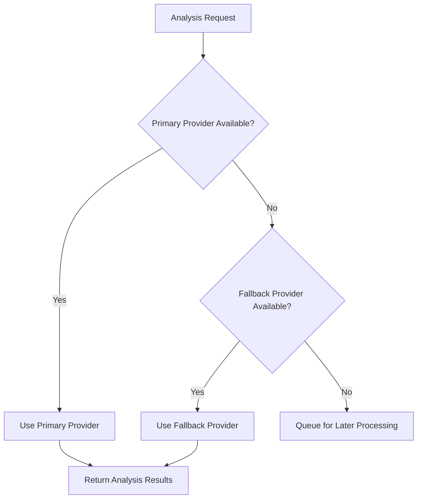

# AI Analysis

Discover how ProtoScribe's advanced AI analysis helps optimize your clinical trial protocols for CONSORT and SPIRIT compliance.

## Overview

ProtoScribe leverages state-of-the-art Large Language Models (LLMs) to provide comprehensive analysis of clinical trial protocols. Our multi-provider approach ensures robust, reliable, and insightful analysis results.

## AI Providers

### Supported Models

ProtoScribe supports multiple leading AI providers:

| Provider | Models | Strengths |
|----------|--------|-----------|
| **OpenAI** | GPT-4, GPT-4 Turbo | Excellent reasoning, comprehensive analysis |
| **Anthropic** | Claude-3 Opus, Claude-3 Sonnet | Strong safety, detailed explanations |
| **Azure OpenAI** | GPT-4 (Enterprise) | Enterprise security, compliance |

### Provider Selection

Choose the best AI provider for your needs:

- **Automatic**: ProtoScribe selects optimal provider based on availability
- **Specific Provider**: Choose your preferred AI model
- **Fallback Chain**: Automatic switching if primary provider is unavailable



## Analysis Types

### 1. Comprehensive Analysis

A complete evaluation of your protocol covering all aspects:

#### CONSORT Compliance
- **Study Design**: Randomization, blinding, allocation
- **Participants**: Eligibility criteria, recruitment, consent
- **Interventions**: Treatment descriptions, comparisons
- **Outcomes**: Primary and secondary endpoints
- **Statistical Methods**: Sample size, analysis plans
- **Results Reporting**: Data presentation standards

#### SPIRIT Compliance
- **Administrative Information**: Title, registry, funding
- **Introduction**: Background, rationale, objectives
- **Methods**: Study design, participants, interventions
- **Ethics and Dissemination**: Approvals, consent, publication
- **Appendices**: Supporting documents and materials

### 2. Focused Analysis

Target specific areas of your protocol:

#### Clarity Analysis
- **Language Quality**: Clear, professional writing
- **Technical Precision**: Accurate medical terminology
- **Logical Flow**: Coherent structure and organization
- **Completeness**: All required information present

#### Consistency Analysis
- **Internal Consistency**: Aligned information throughout
- **Terminology**: Consistent use of terms and definitions
- **Cross-References**: Proper section linkages
- **Data Coherence**: Matching numbers and specifications

### 3. Comparative Analysis

Compare your protocol against best practices:

#### Benchmark Comparison
- **Industry Standards**: Compare against typical protocols
- **Regulatory Examples**: Align with approved studies
- **Best Practices**: Incorporate proven approaches
- **Quality Metrics**: Quantitative assessment scores

## Analysis Process

### Step-by-Step Workflow

1. **Protocol Preprocessing**
   - Document parsing and structure analysis
   - Section identification and categorization
   - Content extraction and cleanup

2. **AI Model Invocation**
   - Intelligent prompt construction
   - Context-aware analysis requests
   - Provider-specific optimizations

3. **Results Processing**
   - Response validation and formatting
   - Suggestion categorization and scoring
   - Quality assurance checks

4. **Report Generation**
   - Executive summary creation
   - Detailed findings compilation
   - Actionable recommendations

### Real-Time Progress

Monitor analysis progress with live updates:

- **📊 Parsing Protocol**: Extracting and organizing content
- **🤖 AI Analysis**: Running AI model analysis
- **📋 Generating Suggestions**: Creating actionable recommendations
- **✅ Analysis Complete**: Results ready for review

## Analysis Results

### Executive Summary

High-level overview of protocol assessment:

```yaml
Overall Score: 85/100
Compliance Level: Good
Critical Issues: 2
Recommendations: 12
Estimated Review Time: 45 minutes
```

### Detailed Findings

Comprehensive breakdown by category:

#### 🟢 Strengths
- Well-defined primary endpoints
- Clear participant eligibility criteria
- Appropriate statistical methodology
- Comprehensive safety monitoring

#### 🟡 Areas for Improvement
- Missing sample size justification details
- Incomplete randomization sequence description
- Limited adverse event reporting procedures

#### 🔴 Critical Issues
- No data monitoring committee specified
- Missing interim analysis stopping rules

### Suggestion Categories

Recommendations are organized by priority and type:

#### High Priority
- **Regulatory Compliance**: Must-fix for approval
- **Safety Concerns**: Critical patient safety issues
- **Statistical Validity**: Essential for study integrity

#### Medium Priority
- **Best Practices**: Recommended improvements
- **Clarity Enhancements**: Better communication
- **Efficiency Gains**: Process optimizations

#### Low Priority
- **Style Improvements**: Writing and formatting
- **Additional Details**: Supplementary information
- **Future Considerations**: Long-term enhancements

## Advanced Features

### Provider Comparison

Compare analysis results across different AI models:

| Aspect | OpenAI GPT-4 | Anthropic Claude | Consensus |
|--------|--------------|------------------|-----------|
| Overall Score | 85/100 | 87/100 | 86/100 |
| Critical Issues | 2 | 3 | 2-3 |
| Recommendations | 12 | 15 | ~13 |
| Processing Time | 45s | 38s | - |

### Confidence Scoring

Each suggestion includes confidence metrics:

- **High Confidence (90-100%)**: Clear, well-supported recommendations
- **Medium Confidence (70-89%)**: Likely beneficial improvements
- **Low Confidence (50-69%)**: Suggestions requiring review

### Contextual Analysis

AI models consider multiple factors:

- **Study Type**: Phase I/II/III specific requirements
- **Therapeutic Area**: Disease-specific considerations
- **Regulatory Region**: FDA, EMA, ICH guidelines
- **Institution Type**: Academic vs. pharmaceutical requirements

## Quality Assurance

### Validation Checks

ProtoScribe implements multiple quality controls:

1. **Response Validation**: Ensure AI outputs are complete and valid
2. **Consistency Checks**: Verify recommendations align across providers
3. **Guideline Alignment**: Confirm compliance with CONSORT/SPIRIT
4. **Content Safety**: Filter inappropriate or unsafe suggestions

### Human Oversight

While AI provides powerful analysis, human review is essential:

- **Expert Review**: Clinical experts validate AI recommendations
- **Domain Knowledge**: Subject matter expertise supplements AI insights
- **Regulatory Awareness**: Current regulatory landscape considerations
- **Practical Implementation**: Real-world feasibility assessment

## Customization Options

### Analysis Parameters

Customize analysis to your specific needs:

- **Guideline Focus**: Emphasize CONSORT vs. SPIRIT requirements
- **Study Phase**: Tailor analysis for Phase I, II, or III trials
- **Therapeutic Area**: Oncology, cardiology, neurology specializations
- **Regulatory Region**: FDA, EMA, Health Canada requirements

### Output Preferences

Control analysis output format and detail:

- **Verbosity Level**: Brief summaries vs. detailed explanations
- **Technical Depth**: Basic vs. advanced recommendations
- **Focus Areas**: Emphasize specific protocol sections
- **Report Format**: Executive summary vs. comprehensive analysis

!!! tip "Optimization Tip"
    Run multiple analysis types to get comprehensive coverage: start with comprehensive analysis, then use focused analysis for specific areas needing attention.

!!! warning "Important Note"
    AI analysis provides valuable insights and recommendations, but should always be reviewed by qualified clinical research professionals before implementation.

!!! info "Performance"
    Analysis typically takes 30-60 seconds depending on protocol length and complexity. Longer protocols may require additional processing time.
