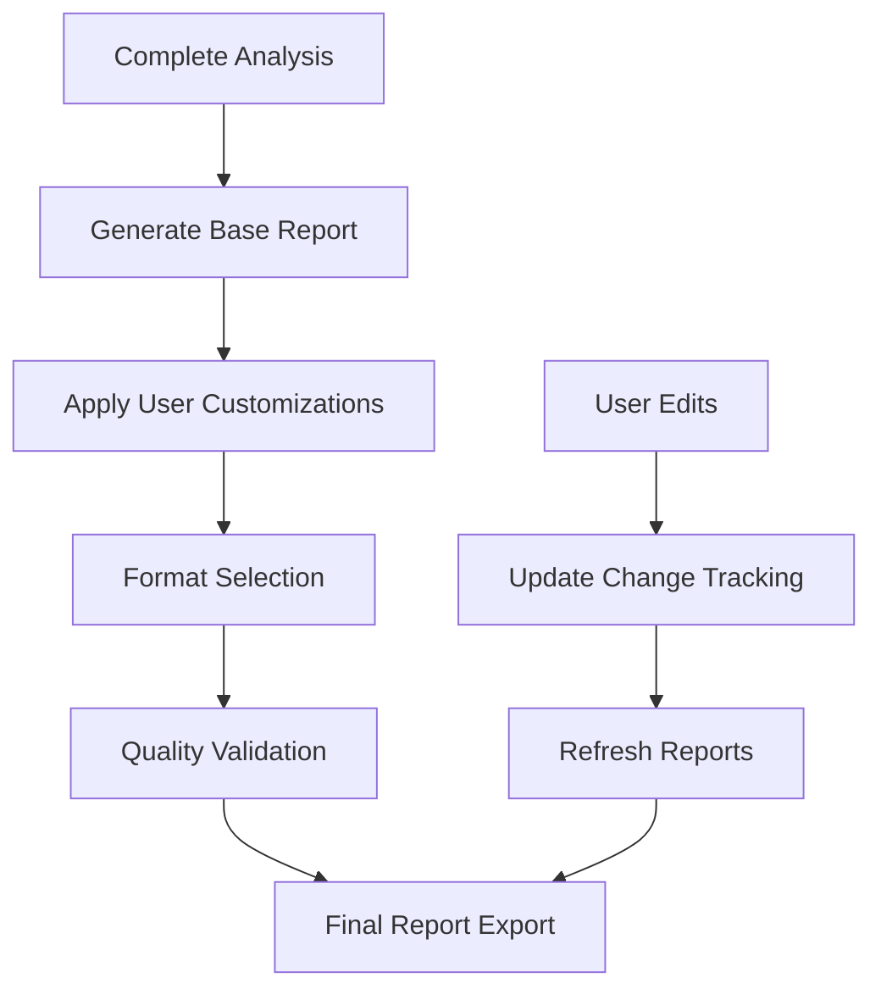

# Export & Reports

Learn how to generate comprehensive reports and export optimized clinical trial protocols from ProtoScribe.

## Export Options

ProtoScribe provides multiple export formats to meet different needs in the clinical research workflow.

### Protocol Export Formats

#### Microsoft Word (.docx)
**Best for**: Regulatory submissions, collaborative editing

- **Track Changes**: Preserves modification history
- **Comments**: Includes reviewer notes and explanations
- **Formatting**: Professional regulatory document styling
- **Version Control**: Embedded change tracking

```yaml
Export Settings:
  - Include change history: Yes/No
  - Show AI suggestions as comments: Yes/No
  - Apply professional formatting: Yes/No
  - Include compliance checklist: Yes/No
```

#### PDF Document (.pdf)
**Best for**: Final submissions, read-only distribution

- **Professional Layout**: Clean, submission-ready formatting
- **Digital Signatures**: Support for electronic signatures
- **Compliance Annotations**: Embedded guideline references
- **Version Stamping**: Date and version watermarks

#### Markdown (.md)
**Best for**: Version control, web publishing

- **Version Control Friendly**: Git-compatible format
- **Web Publishing**: Easy conversion to HTML
- **Collaborative Editing**: Plain text collaboration
- **Documentation Sites**: Integration with docs platforms

#### HTML Report (.html)
**Best for**: Interactive viewing, web sharing

- **Interactive Navigation**: Clickable table of contents
- **Responsive Design**: Mobile and desktop friendly
- **Embedded Analysis**: Interactive compliance scores
- **Rich Media**: Charts, graphs, and visualizations

### Report Types

#### 1. Executive Summary Report

High-level overview perfect for stakeholders and decision-makers.

**Contents:**
- Protocol overview and key metrics
- Compliance score summary
- Critical issues and recommendations
- Implementation timeline
- Resource requirements

**Format Options:**
- PDF executive brief (2-3 pages)
- PowerPoint presentation
- HTML dashboard
- Word summary document

#### 2. Detailed Analysis Report

Comprehensive analysis for research teams and regulatory reviewers.

**Contents:**
- Complete AI analysis results
- Section-by-section evaluation
- Detailed suggestion explanations
- Compliance mapping to guidelines
- Implementation guidance

**Format Options:**
- Complete Word document (15-25 pages)
- Structured PDF report
- Interactive HTML report
- Sectioned markdown files

#### 3. Compliance Checklist Report

CONSORT and SPIRIT guideline compliance verification.

**Contents:**
- Checklist item status (✅ Complete, ⚠️ Partial, ❌ Missing)
- Guideline requirement explanations
- Protocol section mappings
- Recommendations for incomplete items
- Regulatory submission readiness

**Format Options:**
- Excel spreadsheet with status tracking
- PDF checklist with annotations
- Interactive HTML checklist
- CSV for database import

#### 4. Change Summary Report

Track all modifications made during the optimization process.

**Contents:**
- Before/after comparisons
- Change categorization and justification
- Review history and timestamps
- Reviewer comments and decisions
- Quality impact assessment

**Format Options:**
- Track changes Word document
- Side-by-side PDF comparison
- Git-style diff HTML report
- Structured change log (JSON/XML)

## Report Generation

### Automated Report Creation

ProtoScribe automatically generates reports based on your analysis and editing activity:



### Custom Report Builder

Create tailored reports for specific audiences:

#### Report Sections
Select which sections to include:

- ☑️ Executive Summary
- ☑️ Methodology Assessment
- ☑️ Statistical Review
- ☑️ Safety Evaluation
- ☑️ Regulatory Compliance
- ☑️ Implementation Recommendations

#### Audience Customization
Tailor content for different stakeholders:

- **Regulatory Reviewers**: Focus on compliance and submissions
- **Research Teams**: Emphasize methodology and implementation
- **Executives**: Highlight business impact and timelines
- **Ethics Committees**: Prioritize safety and ethical considerations

### Report Templates

#### Standard Templates

**Regulatory Submission Package**
```yaml
Template: regulatory_submission
Includes:
  - Executive summary (2 pages)
  - Compliance checklist (CONSORT/SPIRIT)
  - Detailed analysis report (20-30 pages)
  - Change documentation
  - Supporting appendices
Format: PDF + Word
```

**Internal Review Package**
```yaml
Template: internal_review
Includes:
  - Executive dashboard
  - Section-by-section analysis
  - Reviewer comments and responses
  - Implementation timeline
  - Resource requirements
Format: HTML + PDF
```

**Academic Publication Support**
```yaml
Template: academic_publication
Includes:
  - Methodology description
  - Statistical analysis plan
  - CONSORT flow diagram
  - Protocol summary table
  - Supplementary materials
Format: Word + LaTeX
```

#### Custom Templates

Create organization-specific templates:

- **Institutional Requirements**: Include required sections and formats
- **Therapeutic Area Focus**: Emphasize disease-specific considerations
- **Regulatory Region**: Tailor for FDA, EMA, or other authorities
- **Study Phase**: Customize for Phase I, II, or III requirements

## Export Process

### Step-by-Step Export

1. **Select Export Type**
   - Choose report type (executive, detailed, checklist, etc.)
   - Select target audience
   - Pick output format

2. **Customize Content**
   - Include/exclude sections
   - Set detail level
   - Configure formatting options

3. **Review Preview**
   - Check report structure
   - Verify content accuracy
   - Validate formatting

4. **Generate & Download**
   - Process report generation
   - Download final files
   - Save to protocol library

### Batch Export

For multiple protocols or comprehensive project documentation:

- **Multi-Protocol Reports**: Compare multiple studies
- **Project Portfolios**: Combine related protocols
- **Regulatory Packages**: Complete submission sets
- **Audit Trails**: Comprehensive change documentation

## Advanced Features

### Dynamic Content

Reports include dynamic elements that update automatically:

#### Real-Time Metrics
- **Compliance Scores**: Updated as changes are made
- **Progress Tracking**: Current status indicators
- **Quality Metrics**: Quantitative assessments
- **Timeline Updates**: Revised implementation schedules

#### Interactive Elements
- **Clickable Navigation**: Jump to specific sections
- **Expandable Details**: Show/hide detailed information
- **Filter Options**: Focus on specific areas
- **Search Functionality**: Find content quickly

### Integration Options

#### Document Management Systems
- **SharePoint**: Direct upload to organizational libraries
- **Google Drive**: Cloud storage integration
- **Box**: Enterprise file sharing
- **OneDrive**: Personal and business storage

#### Regulatory Systems
- **eCTD Publishing**: Direct submission format generation
- **Regulatory Databases**: Integration with tracking systems
- **Validation Tools**: Automated compliance checking
- **Submission Platforms**: Direct upload capabilities

#### Quality Management
- **QMS Integration**: Connect with quality systems
- **Audit Trail**: Comprehensive change documentation
- **Approval Workflows**: Route for review and approval
- **Archive Management**: Long-term storage solutions

## Quality Assurance

### Export Validation

Before finalizing exports, ProtoScribe performs comprehensive validation:

#### Content Validation
- **Completeness Check**: Ensure all sections present
- **Accuracy Verification**: Validate data and references
- **Consistency Review**: Check internal consistency
- **Format Compliance**: Verify template adherence

#### Technical Validation
- **File Integrity**: Ensure error-free file generation
- **Format Compatibility**: Test with target applications
- **Size Optimization**: Optimize file sizes
- **Security Scanning**: Check for potential issues

### Version Control

Maintain comprehensive version history:

- **Export Tracking**: Log all generated reports
- **Change Attribution**: Link exports to specific versions
- **Access Control**: Manage who can generate exports
- **Audit Trail**: Complete activity logging

## Customization & Branding

### Organizational Branding

Customize reports with your organization's identity:

#### Visual Elements
- **Logos**: Add institutional or company logos
- **Color Schemes**: Match organizational branding
- **Fonts**: Use preferred typography
- **Layouts**: Custom page designs

#### Content Standards
- **Headers/Footers**: Standard document elements
- **Disclaimers**: Legal and regulatory statements
- **Contact Information**: Responsible parties
- **Document Properties**: Metadata and attributes

### Template Management

Create and manage custom templates:

- **Template Library**: Organize reusable formats
- **Sharing Options**: Distribute templates across teams
- **Version Control**: Track template updates
- **Access Management**: Control template usage

!!! tip "Efficiency Tip"
    Create standardized export templates for common use cases (regulatory submissions, IRB reviews, publication support) to streamline your workflow.

!!! warning "Validation Reminder"
    Always review exported documents for accuracy and completeness before distribution or submission to regulatory authorities.

!!! info "File Sizes"
    Comprehensive reports can be large (10-50MB). Consider creating separate executive summaries for quick sharing and detailed reports for thorough review.
