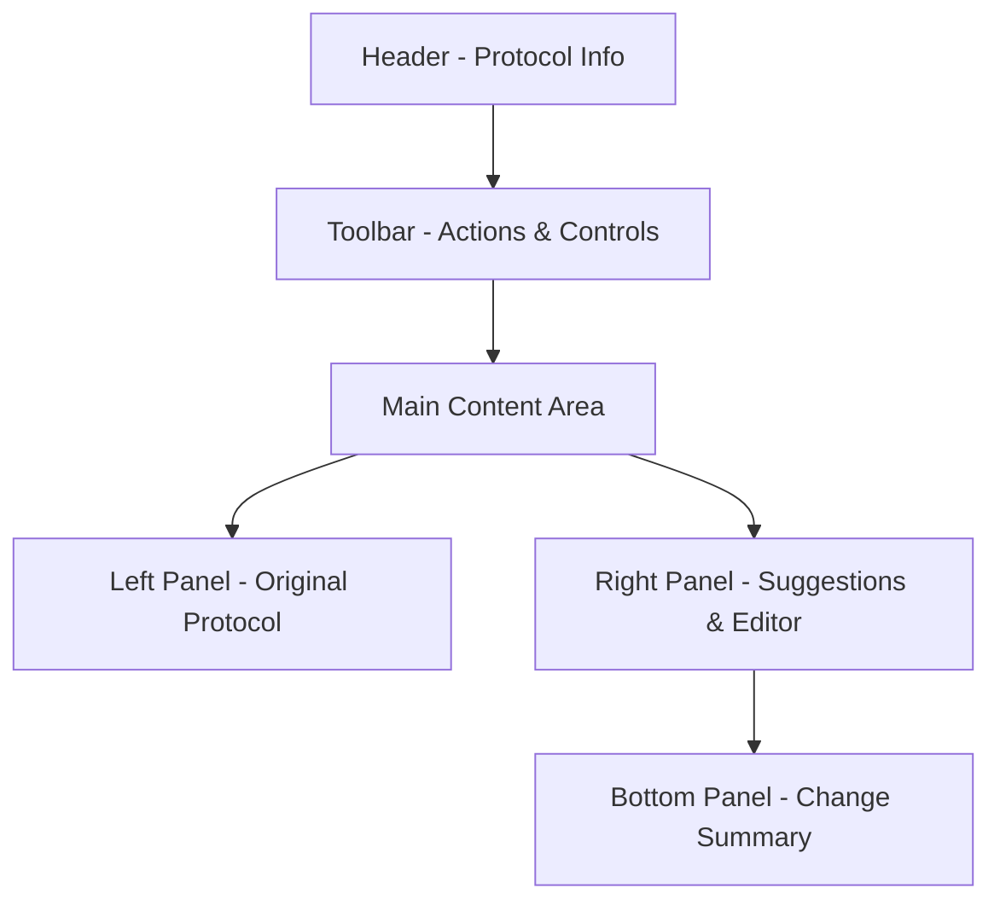
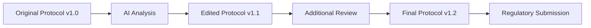

# Interactive Editor

Master ProtoScribe's powerful interactive editor to review, refine, and implement AI-generated suggestions for optimal protocol compliance.

## Editor Overview

The Interactive Editor is the heart of ProtoScribe's protocol optimization workflow. It provides a seamless interface for reviewing AI suggestions and implementing improvements to your clinical trial protocols.

### Key Features

- **Side-by-Side View**: Original protocol and suggested improvements
- **Real-Time Preview**: See changes as you make them
- **Suggestion Management**: Accept, edit, or reject recommendations
- **Version Control**: Track all changes and iterations
- **Export Options**: Generate final protocol documents

## Editor Interface

### Layout Components



#### Header Section
- **Protocol Title**: Current protocol name and metadata
- **Analysis Score**: Overall compliance score and status
- **Progress Indicator**: Completion status of review process

#### Toolbar
- **Save Changes**: Preserve current modifications
- **Export Protocol**: Generate updated document
- **Undo/Redo**: Navigate change history
- **Settings**: Customize editor preferences

#### Content Panels
- **Original Text**: Source protocol content with highlights
- **Suggestions Panel**: AI recommendations with context
- **Editor Panel**: Interactive text editing interface
- **Change Tracking**: Summary of all modifications

## Working with Suggestions

### Suggestion Types

ProtoScribe categorizes suggestions to help prioritize your review:

#### 🔴 Critical Issues
**High-impact compliance problems requiring immediate attention**

Example:
```
Issue: Missing primary endpoint definition
Location: Section 3.2 - Study Objectives
Suggestion: Add specific, measurable primary endpoint with clear success criteria
Priority: Critical
Confidence: 95%
```

#### 🟡 Improvement Opportunities
**Enhancements that strengthen protocol quality**

Example:
```
Issue: Incomplete randomization description
Location: Section 4.1 - Randomization
Suggestion: Specify block size, stratification factors, and allocation sequence generation
Priority: Medium
Confidence: 88%
```

#### 🟢 Style & Clarity
**Language and formatting improvements**

Example:
```
Issue: Unclear terminology usage
Location: Section 2.3 - Definitions
Suggestion: Define "serious adverse event" according to ICH-GCP standards
Priority: Low
Confidence: 76%
```

### Suggestion Actions

For each suggestion, you have four options:

#### 1. ✅ Accept
Automatically implement the suggestion as recommended:

- **One-Click Implementation**: Instantly apply the change
- **Automatic Integration**: Seamlessly merge with existing content
- **Change Tracking**: Log the modification for review

#### 2. ✏️ Edit
Modify the suggestion before implementation:

- **Custom Text**: Write your own version
- **Hybrid Approach**: Combine AI suggestion with your expertise
- **Context Preservation**: Maintain consistency with protocol style

#### 3. 🔄 Revise
Request alternative suggestions from the AI:

- **Different Approach**: Ask for alternative recommendations
- **More Specific**: Request targeted, detailed suggestions
- **Provider Switch**: Try different AI model for comparison

#### 4. ❌ Reject
Dismiss the suggestion with optional feedback:

- **Not Applicable**: Suggestion doesn't fit your protocol
- **Already Addressed**: Content is adequate as written
- **Different Approach**: Using alternative solution

### Bulk Actions

Efficiently manage multiple suggestions:

- **Accept All High Priority**: Implement all critical recommendations
- **Reject All Style**: Dismiss formatting suggestions
- **Review by Section**: Process suggestions by protocol section
- **Filter by Type**: Focus on specific categories

## Editing Workflow

### Step-by-Step Process

1. **Review Analysis Results**
   - Examine executive summary
   - Identify priority areas
   - Plan review strategy

2. **Navigate Suggestions**
   - Start with critical issues
   - Work through medium priority items
   - Address style improvements last

3. **Implement Changes**
   - Accept clear improvements
   - Edit suggestions to fit context
   - Reject inappropriate recommendations

4. **Validate Results**
   - Review change summary
   - Check protocol consistency
   - Verify compliance improvements

5. **Export Final Protocol**
   - Generate updated document
   - Save version with changes
   - Prepare for regulatory submission

### Smart Navigation

The editor provides intelligent navigation tools:

#### Section Jumping
- **Protocol Outline**: Navigate by section structure
- **Suggestion Hotspots**: Jump to areas with most recommendations
- **Priority Sorting**: Review critical issues first

#### Search & Filter
- **Text Search**: Find specific content quickly
- **Suggestion Filter**: Show only certain types
- **Change History**: Review previous modifications

#### Progress Tracking
- **Completion Status**: Track review progress
- **Remaining Items**: Count unresolved suggestions
- **Quality Score**: See improvement metrics

## Advanced Editor Features

### Real-Time Collaboration

For team-based protocol development:

- **Multi-User Support**: Multiple reviewers simultaneously
- **Comment System**: Add notes and discussions
- **Role-Based Access**: Different permissions for team members
- **Change Attribution**: Track who made what changes

### Version Management

Comprehensive version control:



- **Version History**: Complete change timeline
- **Branch Management**: Create alternative versions
- **Rollback Options**: Revert to previous versions
- **Comparison Views**: Side-by-side version comparisons

### Custom Templates

Create reusable protocol elements:

- **Section Templates**: Standard protocol sections
- **Compliance Checklists**: CONSORT/SPIRIT requirements
- **Institution Standards**: Organization-specific requirements
- **Regulatory Templates**: Region-specific formats

## Quality Assurance

### Built-in Validation

The editor includes automatic quality checks:

#### Consistency Validation
- **Cross-Reference Checking**: Ensure matching information
- **Terminology Consistency**: Verify uniform language use
- **Numerical Accuracy**: Check calculations and references
- **Format Compliance**: Maintain document structure

#### Compliance Monitoring
- **CONSORT Checklist**: Real-time compliance tracking
- **SPIRIT Guidelines**: Automatic requirement verification
- **Regulatory Standards**: Region-specific validations
- **Best Practice Alerts**: Industry standard recommendations

### Export Validation

Before final export, ProtoScribe performs:

- **Complete Protocol Scan**: Ensure all sections present
- **Reference Validation**: Verify citations and cross-references
- **Format Consistency**: Standardize styling and structure
- **Final Compliance Check**: Confirm guideline adherence

## Keyboard Shortcuts

Boost productivity with editor shortcuts:

| Action | Shortcut | Description |
|--------|----------|-------------|
| Accept Suggestion | `Ctrl+Enter` | Apply current suggestion |
| Reject Suggestion | `Ctrl+Delete` | Dismiss current suggestion |
| Next Suggestion | `Ctrl+→` | Move to next recommendation |
| Previous Suggestion | `Ctrl+←` | Move to previous recommendation |
| Save Changes | `Ctrl+S` | Save current modifications |
| Undo | `Ctrl+Z` | Reverse last action |
| Redo | `Ctrl+Y` | Restore undone action |
| Find in Protocol | `Ctrl+F` | Search protocol content |

## Customization Options

### Editor Preferences

Tailor the editor to your workflow:

#### Display Options
- **Panel Layout**: Horizontal vs. vertical split
- **Font Settings**: Size, family, and spacing
- **Color Themes**: Light, dark, or custom themes
- **Highlighting**: Suggestion and change emphasis

#### Workflow Settings
- **Auto-Save**: Automatic change preservation
- **Suggestion Ordering**: Priority vs. document order
- **Confirmation Dialogs**: Safety prompts for actions
- **Backup Frequency**: Version save intervals

### Integration Settings

Connect with external tools:

- **Document Management**: SharePoint, Google Drive integration
- **Regulatory Systems**: eCTD, regulatory database connections
- **Quality Systems**: Connect with QMS platforms
- **Communication Tools**: Slack, Teams notifications

!!! tip "Efficiency Tip"
    Start by accepting all high-confidence, critical suggestions to quickly address major compliance issues, then focus on customizing medium-priority recommendations.

!!! warning "Review Reminder"
    Always have a qualified clinical research professional review AI-generated changes before finalizing your protocol for regulatory submission.

!!! info "Performance Note"
    The editor auto-saves your progress every 30 seconds. For large protocols, consider working in sections to maintain optimal performance.
